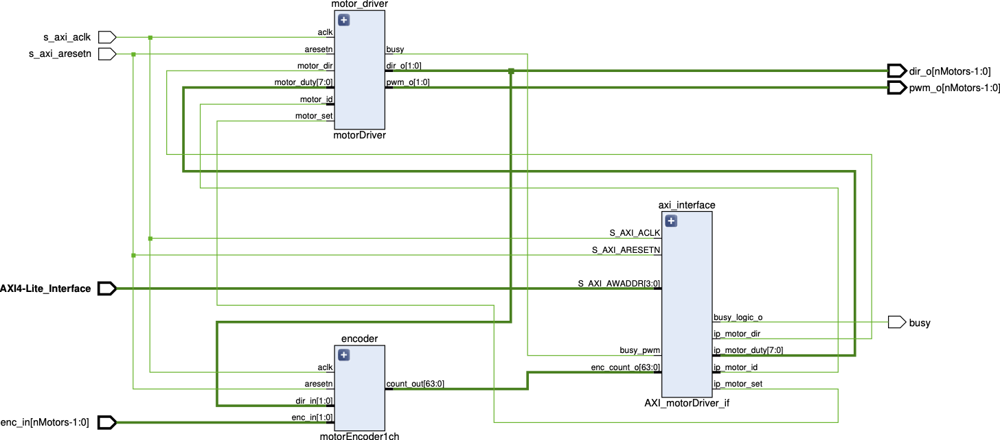
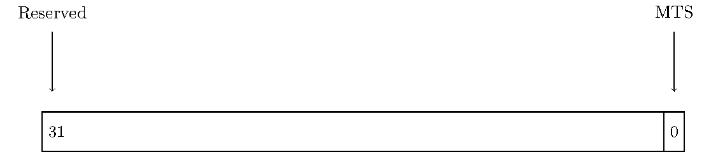
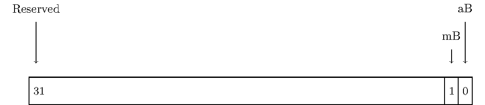
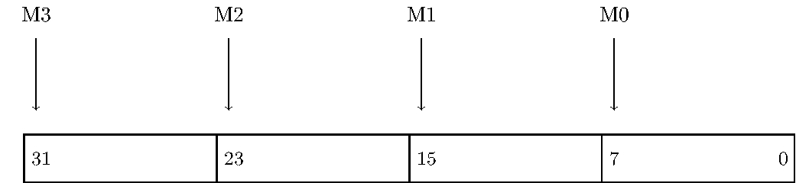
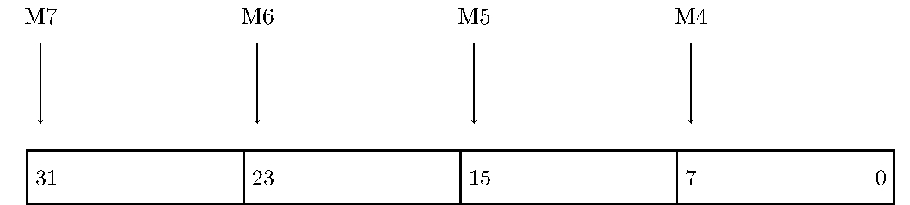
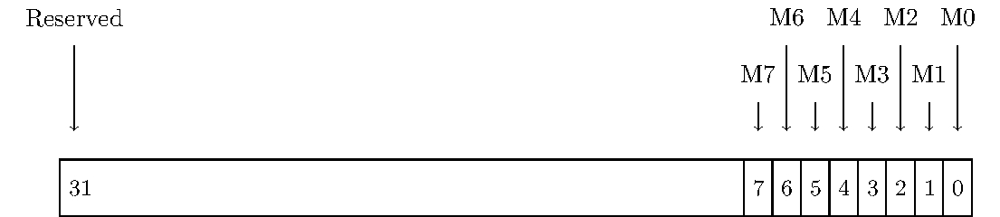

## AXI Motor Driver
The **AXI\_motorDriver** module is designed to provide an interface for controlling multiple motors using the Advanced eXtensible Interface (AXI) protocol. It serves as a bridge between the AXI bus and motor drivers used in Lab 1 of ACSR, allowing users to configure motor parameters and control their operation efficiently.

### Features
- Supports up to 8 motors, with configurable parameters such as PWM signal frequency.
- Utilizes the AXI4-lite protocol for efficient communication and interfacing.
- Provides control over PWM duty cycle and direction for each motor.
- Integrates encoder inputs for accurate motor position feedback.

### Functional Description
The following figure illustrates the overall architecture of the module.

<!--  -->

- **AXI4-Lite Interface**: This interface facilitates communication between the module and the AXI bus, allowing for register-based configuration and control. Inside there is the Registers used to store configuration and control data for the motor drivers. These registers are accessible through the AXI4-Lite interface.
- **MotorDriver**: The motor driver component receives commands from the module and generates PWM signals to control the speed and direction of the motors.
- **1-Channel Motor Encoder Module**: This module interfaces with motor encoders to provide feedback on motor position, enabling closed-loop control.

The module also incorporates dynamic motor driver logic, which adjusts motor control parameters of every motor based on real-time feedback and the user-defined registers that are stored.

### I/O Signals
The table below summarizes the input and output signals of the **AXI\_motorDriver** module.

| **Signal Name** | **Interface** | **I/O** | **Init. State** | **Description** |
|-----------------|---------------|---------|-----------------|-----------------|
| `enc_in`        | Generic       | Input   | `0x0`           | Motor encoder input signals |
| `busy`          | Generic       | Output  | `0`             | Signal indicating module operation |
| `pwm_o`         | Generic       | Output  | `0x0`           | PWM signals for motor speed control |
| `dir_o`         | Generic       | Output  | `0x0`           | Direction signals for motor control |
| `S_AXI*`        | AXI4-Lite     | -       | -               | AXI4-Lite interface signals |
| `S_AXI_ACLK`    | System        | Input   | -               | AXI clock signal |
| `S_AXI_ARESETN` | System        | Input   | -               | AXI reset signal |

### Register Space
The table below outlines the register space of the **AXI\_motorDriver** module.

| **Addr. Offset1** | **Reg. Name** | **Access** | **Description** |
|------------------------------|---------------|------------|-----------------|
| 0x04                         | `CR`          | W          | Register for controlling motor driver operation |
| 0x08                         | `SR`          | R          | Register for reading status information |
| 0x0C                         | `PWM_A`       | RW         | Register for setting PWM values for Motor 0 - 3 |
| 0x10                         | `PWM_B`       | RW         | Register for setting PWM values for Motor 4 - 7 |
| 0x14                         | `DIR`         | RW         | Register for setting direction of motor rotation |
| 0x20                         | `ENC_M0`      | R          | Encoder state value for Motor 0 |
| 0x24                         | `ENC_M1`      | R          | Encoder state value for Motor 1 |
| 0x28                         | `ENC_M2`      | R          | Encoder state value for Motor 2 |
| 0x2C                         | `ENC_M3`      | R          | Encoder state value for Motor 3 |
| 0x30                         | `ENC_M4`      | R          | Encoder state value for Motor 4 |
| 0x34                         | `ENC_M5`      | R          | Encoder state value for Motor 5 |
| 0x38                         | `ENC_M6`      | R          | Encoder state value for Motor 6 |
| 0x3C                         | `ENC_M7`      | R          | Encoder state value for Motor 7 |

1 Address Space Offset is relative to `C_BASEADDR` assignment.

Below you find a detailed description of every register:

### Control Register (CR)

### Status Register (SR)

### PWM\_A Register

### PWM\_B Register

### Direction Register (DIR)
